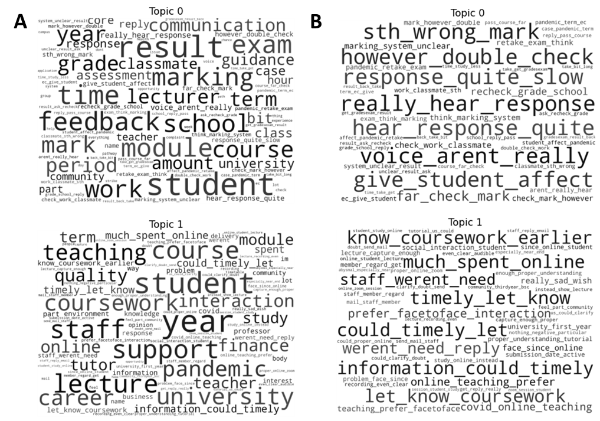

# Analysing survey feedback using topic modelling

The goal of this project was to demonstrate topic analyses on text comments from university students using Apache Spark. Topic analysis was conducted using Latent Dirichlet Allocation (LDA).

**Why?**

Universities have a moral and regulatory obligation to provide students with an optimal teaching and learning experience. It is commonplace to use student feedback, collected via a broad range of institutional and nationwide surveys, to optimise delivery. This involves manual analyses of text comments which is slow, labour intensive and at risk of confirmation bias. If analyses was automated using machine learning and distributed computing techniques, then both the validity and efficiency of findings could be improved which, in-turn, could lead to improvements in the student experience.

## Scope

This proof of concept study is limited to the National Student Survey (NSS) for three reasons. Firstly, it is the largest survey of UK students. Secondly, it is used by the Office for Students to benchmark student satisfaction and ensure quality and standard requirements are met. Finally, NSS results feed into all domestic University league tables, which are important to institutional reputation and prospective students’ application choices.

LDA was chosen for three reasons. Firstly, documents can be associated with more than one topic. This is advantageous as comments frequently include references to multiple aspects of the student experience. Secondly, it is an unsupervised algorithm. This meant manual labelling of comments was unnecessary. Finally, LDA is supported by the PySpark library. This enabled development of a workflow appropriate for distributed computing.

## File structure

<pre>
|- notebooks/
   |- LDA_topic_modelling_with_PySpark.ipynb
   |- figures/
|- feedback-topic-modelling/
   |- custom_funcs.py
   |- config.py
|- README.md
</pre>

## Implementation

The NLTK, PySpark and Spark NLP libraries were used for text pre-processing. Where data was distributed using the Spark DataFrame class. Pre-processing was conducted in four stages. First, input comments were tokenized and punctuation was removed. Next, tokens were tagged with point-of-speech (POS) labels and then lemmatized. After dropping common stop words (as per NLTK), trigrams were then generated for all comments. Finally, the tokens (i.e. unigrams) and trigrams were concatenated for each comment. 

A random split was used to generate distinct training and test sets (training: 80%, test: 20%) for positive and negative comments. The PySpark library was then used to train a distinct LDA model for both types of comment. Similar to data pre-processing, data was distributed using the Spark DataFrame class. The number of topics tested was from two to four. Prior to training, input sequences were vectorized using term frequency-inverse document frequency (TF-IDF). 

## Conclusion

*Figure 1. Word clouds generated for negative comments using LDA with two topics. A) A word cloud of the top 100 terms (including both unigrams and trigrams). B) A word cloud of the trigrams present in the top 100 terms (i.e. unigrams have been filtered out).*

*Figure 2. Word clouds generated for positive comments using LDA with two topics. A) A word cloud of the top 100 terms (including both unigrams and trigrams). B) A word cloud of the trigrams present in the top 100 terms (i.e. unigrams have been filtered out).*

The topics detected in this study roughly align with themes in the NSS (negative comments: assessment & feedback, teaching on my course, organisation and management; positive comments: academic support, learning community and learning opportunities). Future work should involve hyperparameter optimization using alternative evaluation metrics to perplexity (e.g. word intrusion4) and variants of LDA that are designed with short text in mind (e.g. Gibbs Sampling for Dirichlet Multinomial Mixture5). These approaches may produce more easily interpreted topic models.